# ClassFlow

**Version:** 1.1.0

**Status:** Live — core class and task management features are complete, advanced planning tools are implemented, and major student workflow features are now active.

**ClassFlow** is an Android mobile app that helps students manage classes, assignments, deadlines, reminders, timelines, backups, and academic workload in one place.

## Purpose

ClassFlow makes it easier for students to organize coursework and track academic responsibilities throughout the term. Instead of relying on scattered notes, PDFs, class portals, and separate planning tools, users can manage classes, tasks, deadlines, reminders, search, backups, Gantt timelines, and weekly workload summaries from one mobile platform.

## Problem

Students often miss deadlines or lose track of assignments because course information is spread across multiple systems. ClassFlow addresses this by giving users a structured way to manage classes, tasks, due dates, workload, notifications, and academic planning from one mobile app.

## Screenshots

<div align="center">

| Splash | Home (Empty) | Home |
|:------:|:------------:|:----:|
| 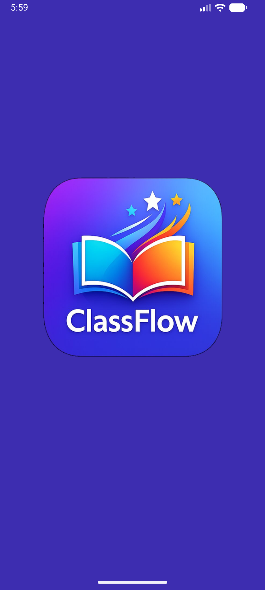 | 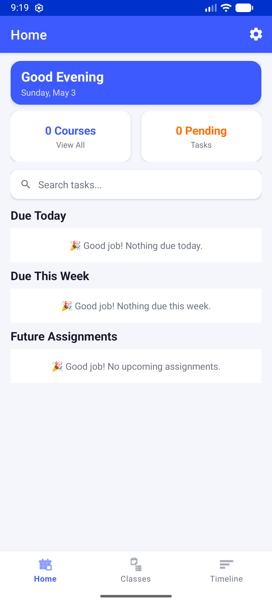 | 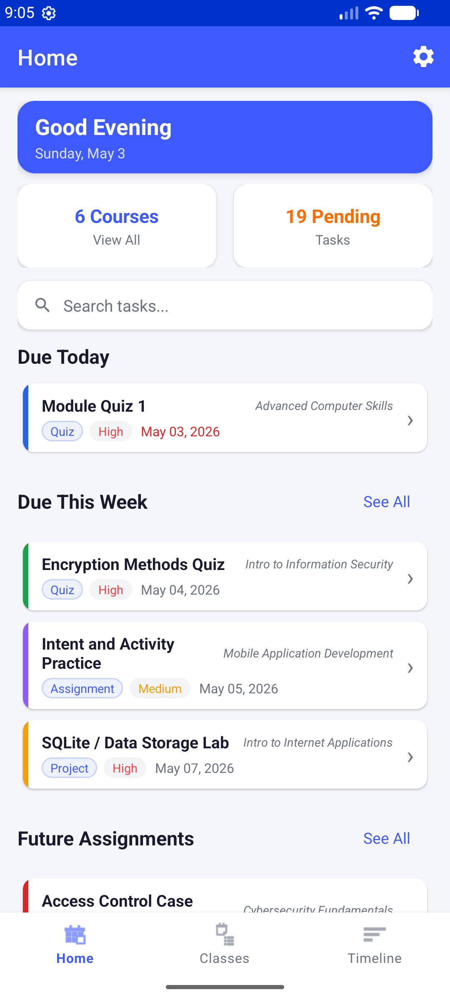 |

| Classes | Tasks | Task Detail |
|:-------:|:-----:|:-----------:|
| 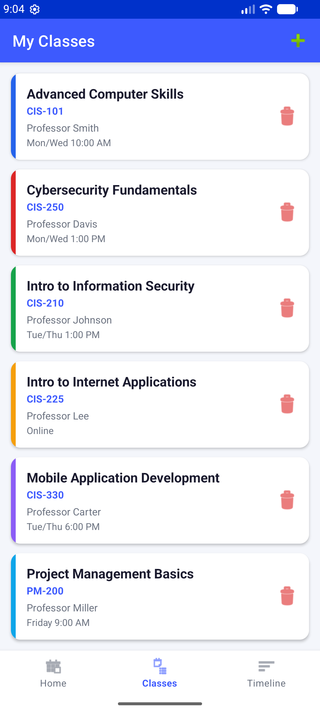 | 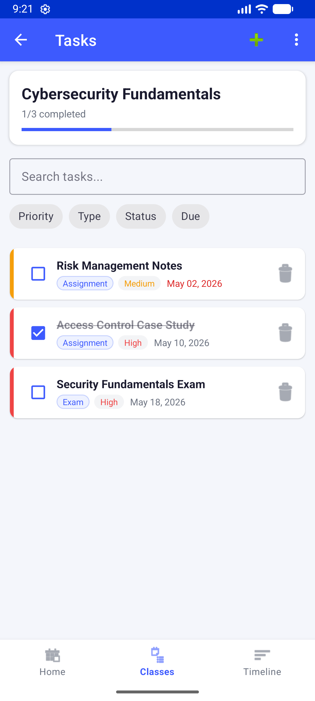 | 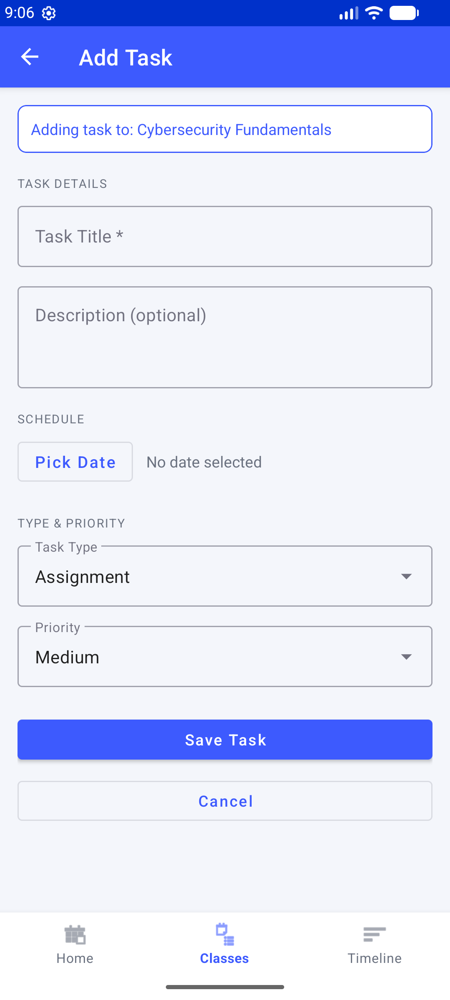 |

| Add Class | Gantt Timeline | Weekly Workload |
|:---------:|:--------------:|:---------------:|
| 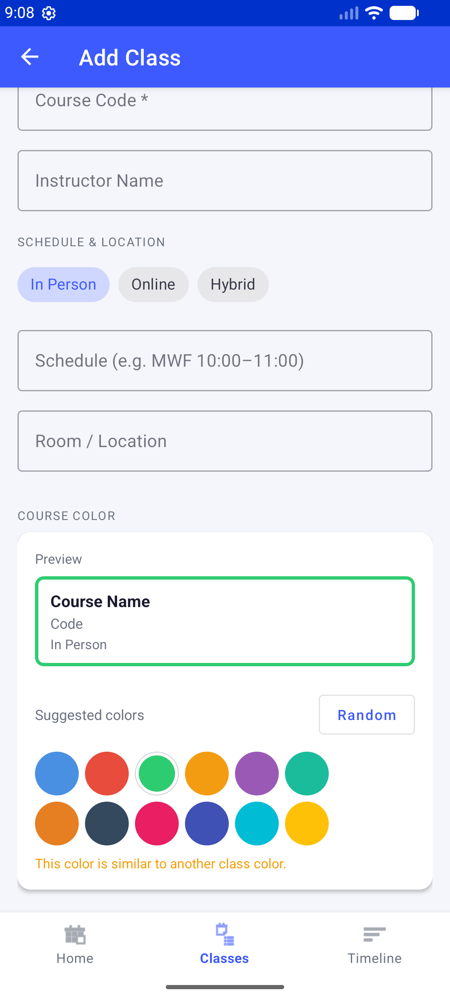 | 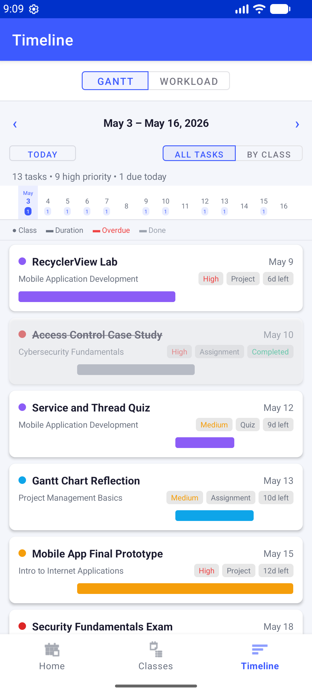 | 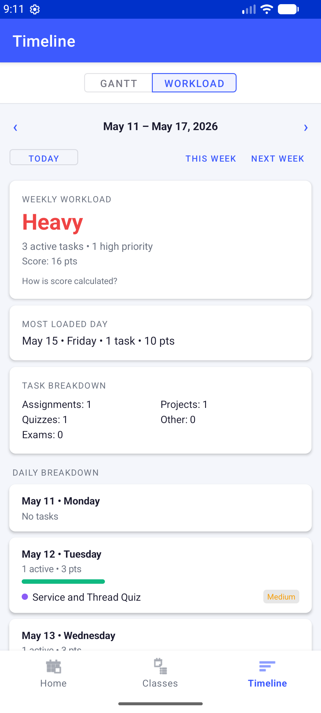 |

| Search | Settings | Module Builder |
|:------:|:--------:|:--------------:|
| 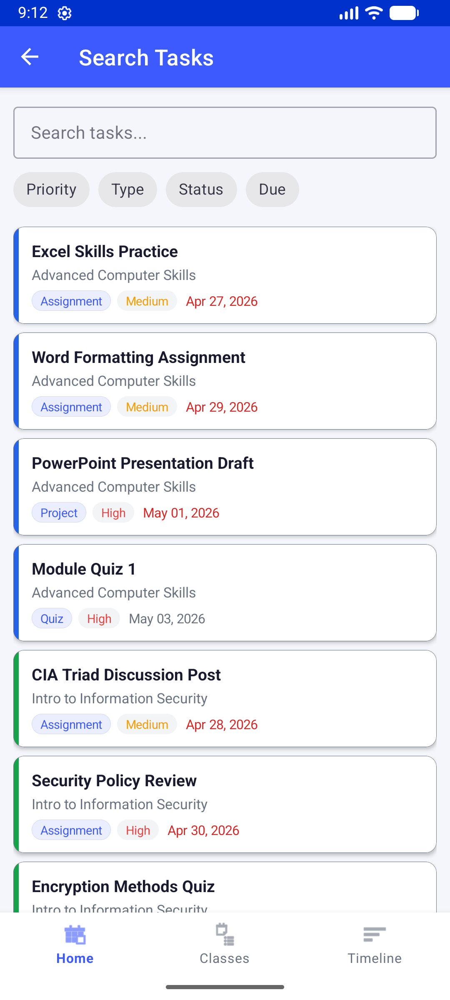 | 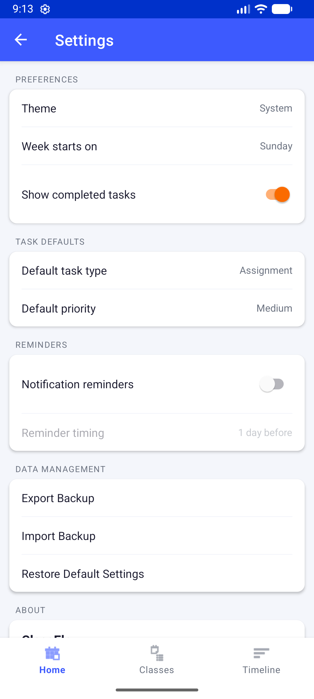 | 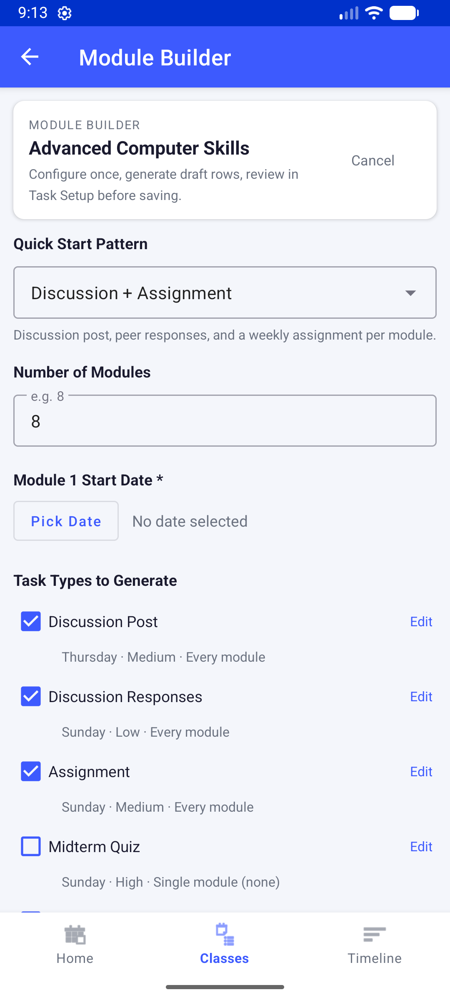 |

</div>

## Platform and Tools

- **Platform:** Android
- **IDE:** Android Studio
- **Language:** Kotlin
- **Storage:** Room Database (SQLite)
- **Architecture:** MVVM (Model-View-ViewModel)
- **Navigation:** Jetpack Navigation Component
- **Notifications:** Android notification channels and scheduled reminders
- **Min SDK:** 24 (Android 7.0)
- **Target SDK:** 35 (Android 15)

## Build Configuration

- Kotlin 2.0.21
- KSP (Kotlin Symbol Processing) — replaces kapt
- Gradle Kotlin DSL (.kts)
- Version Catalog (libs.versions.toml)

## Features Implemented (v1.1.0)

### Core Class Management

- Add, view, and delete classes
- Store course name, course code, instructor, schedule, room/location, class mode, meeting link, platform, and course color
- Class mode support:
  - In Person
  - Online
  - Hybrid
- Conditional fields for room/location, meeting link, and platform
- Improved Add Class screen with grouped sections:
  - Basic Info
  - Schedule & Location
  - Course Color
- Live class preview card while creating a class
- Smart random class color picker
- Duplicate and near-duplicate color warning
- Course color swatches with wrapping layout
- Cascade delete — deleting a class removes all related tasks

### Core Task Management

- Add, view, edit, and delete tasks per class
- Set title, description, due date, task type, priority, and completion status
- Mark tasks as completed with a checkbox
- Supported task types:
  - Assignment
  - Discussion
  - Responses
  - Homework
  - Programming Exercise
  - Lab
  - Quiz
  - Midterm Quiz
  - Exam
  - Final Quiz
  - Final Exam
  - Project
  - Project Paper
  - Other
- Supported priorities:
  - Low
  - Medium
  - High
- Improved Add Task and Task Detail screens
- Theme-aware dropdowns and fields in light and dark mode
- Save/delete actions refresh task lists immediately

### Home Screen

- Time-of-day greeting
- Compact course count and pending task count summary cards
- Search entry point from Home
- **Due Today** section — tasks due today with date highlighted
- **Due This Week** section — tasks due in the next 7 days
- **Future Assignments** section — tasks beyond 7 days
- Empty-state messages when no tasks are due
- Tap any task card to open and edit it directly from Home
- Course name shown on each task card
- Improved dark mode contrast and reduced clutter

### Classes Screen

- List of all courses with color indicator, code, instructor, and schedule
- Add Class button in the top toolbar
- Tap a class to open its task list
- Delete a class with the trash icon
- Class cards support course color indicators

### Tasks Screen

- Per-class task list with progress bar showing completion percentage
- Search and filter controls
- Priority color bar on each task card
- Overdue dates highlighted
- Add Task button in the top toolbar
- Tap a task to open Task Detail for editing
- Improved task card color behavior in light and dark mode

### Search and Filter

ClassFlow includes a dedicated Search Tasks screen.

Implemented search features:

- Search across all loaded tasks
- Preloaded task results
- Live filtering by task title and class name
- Filter chips for:
  - Priority
  - Type
  - Status
  - Due date
- Clear filters action
- Theme-aware result cards
- Result counts for loaded and shown tasks
- Tap search results to open task details

### Syllabus Task Setup

ClassFlow includes a manual bulk-entry workflow for syllabus tasks.

Implemented bulk setup features:

- Add multiple task rows before saving
- Duplicate row
- Clear row
- Copy previous due date
- Add 1 day / Add 7 days date shortcuts
- Task title, type, priority, due date, and description fields
- Submit button placed near class info for visibility
- Review before saving to Room
- Validation for blank or incomplete rows

### Module Builder

ClassFlow includes a Module Builder to quickly generate repeated class tasks from common academic patterns.

Implemented Module Builder features:

- Generate repeated module tasks from selected task types
- Number of modules input
- Module 1 start date selection
- Task type checklist with visible rows for common and advanced academic task types
- Task types ordered by common usage:
  - Discussion Post
  - Discussion Responses
  - Assignment
  - Midterm Quiz
  - Quiz
  - Final Quiz
  - Homework
  - Programming Exercise
  - Lab
  - Exam
  - Final Exam
  - Project
  - Project Paper
- Editable rule settings for task type, priority, due day, and schedule behavior
- Module checkbox selectors for module-specific tasks
- All Modules and Clear controls for module selection
- Midterm single-module selection
- Final quiz/final exam last-module behavior
- Preview summary before generation
- Generated rows are sent to Syllabus Task Setup for review before saving

### Timeline / Gantt Chart View

ClassFlow includes a mobile-friendly Gantt timeline for academic planning.

Implemented Gantt features:

- 2-week timeline window
- Previous 2 Weeks navigation
- Next 2 Weeks navigation
- Today button to return to the current timeline window
- Shared 14-day date header
- Workload density count badges under dates
- All Tasks view
- By Class view
- All Tasks view set as the default
- Task bars aligned to the shared date scale
- Task bars clipped at the visible timeline window edge
- Task duration estimated from task type and priority
- Class color dots for quick course identification
- Due-status chips
- Completed task styling
- Overdue task styling
- Empty-state handling for date windows with no visible tasks

The Gantt Chart View answers:

```text
When are my tasks happening?
```

### Weekly Workload Tracker

ClassFlow includes a Weekly Workload Tracker inside the Timeline section.

Implemented workload features:

- Gantt / Workload tabs inside the Timeline section
- 1-week workload view
- Previous Week navigation
- Next Week navigation
- Today button
- Weekly workload score
- Workload levels:
  - Light
  - Moderate
  - Heavy
  - Overloaded
- Total active task count
- High-priority task count
- Due-today task count
- Completed task count
- Overdue task count when applicable
- Most loaded day
- Task type breakdown
- Daily workload breakdown
- Daily workload bars
- Completed tasks excluded from active workload scoring
- Empty-state handling for weeks with no tasks

The Weekly Workload Tracker answers:

```text
How heavy is my week?
```

### Settings

ClassFlow includes a Settings screen for app preferences and maintenance.

Implemented settings features:

- Theme preferences
- Task default preferences
- Reminder preferences
- Backup import/export access
- About/version section
- Developer Tools access for test utilities

### Notification Reminders

ClassFlow now supports notification testing and reminder infrastructure.

Implemented notification features:

- Android notification permission support
- Notification channel setup
- Immediate test notification
- 10-second scheduled test notification
- Developer Tools screen for notification testing
- Notification icon cleanup
- Reminder settings foundation
- Real task reminder scheduling support for incomplete tasks with due dates

### Backup Import / Export

ClassFlow includes local backup and restore support.

Implemented backup features:

- Export ClassFlow data to JSON
- Import ClassFlow backup JSON
- Backup schema with app name, backup version, export timestamp, classes, and tasks
- Class/task relationship preservation
- Import validation
- Class ID remapping during import
- Merge and replace import behavior
- Backup error handling and import summaries

### Swipe Actions

ClassFlow includes swipe action support for faster task handling.

Implemented swipe behavior:

- Swipe task cards to trigger quick task actions
- Mark task completion faster from task card workflows
- Swipe interactions designed for Home and task-related cards
- Destructive delete actions remain protected

### Navigation

- Bottom navigation bar:
  - Home
  - Classes
  - Timeline
- Timeline section includes:
  - Gantt
  - Workload
- Back navigation fixed — Home button reliably pops the back stack from any screen
- Toolbar back arrow on all sub-screens
- Search, Settings, Developer Tools, Syllabus Task Setup, and Module Builder screens added

### App Icon and Splash Screen

- Custom ClassFlow icon across all mipmap densities
- Branded splash screen on launch
- Fixed double-splash behavior
- Fixed launcher icon sizing
- Notification large icon removed to avoid duplicate notification icons

## Current Development Update

ClassFlow has moved from beta into a live v1.1.0 release state.

The app now includes the main student workflow:

- create classes
- create tasks
- search and filter tasks
- generate module-based task sets
- bulk-create syllabus tasks
- view planning timelines
- review weekly workload
- manage reminders
- backup and restore data
- customize class colors and delivery mode

Major work completed today included Add Class polishing, smart random course colors, Online / In Person / Hybrid class support, notification testing cleanup, splash/icon fixes, Module Builder improvements, backup/import polish, and README/status updates.

## Advanced Features Status

### Implemented

1. **Gantt Chart View**
   - Mobile-friendly 2-week academic timeline
   - All Tasks and By Class views
   - Task bars aligned to a shared date scale
   - Due-status chips, class color indicators, and workload density badges

2. **Weekly Workload Tracker**
   - Weekly workload scoring
   - Light, Moderate, Heavy, and Overloaded levels
   - Weekly navigation
   - Most loaded day, task type breakdown, and daily workload summary

3. **Syllabus Task Setup**
   - Manual bulk-entry task setup
   - Review-before-save workflow
   - Duplicate/clear/copy/date shortcut controls

4. **Module Builder**
   - Repeated module task generation
   - Module checkbox selection
   - Editable rules
   - Review generated rows before saving

5. **Settings Screen**
   - App preferences
   - Reminder settings
   - Backup/import access
   - About/version section
   - Developer Tools

6. **Search and Filter**
   - Dedicated search screen
   - Preloaded task results
   - Priority/type/status/due filters

7. **Swipe Actions for Task Cards**
   - Faster task workflows from cards

8. **Notification Reminders**
   - Notification channel and permission support
   - Test notification tools
   - Reminder scheduling foundation

9. **Export Backup / Import Backup**
   - JSON export/import support
   - Validation and restore workflow

10. **Class Mode and Smart Class Colors**
   - In Person / Online / Hybrid support
   - Meeting link and platform fields
   - Smart random distinct color generation
   - Duplicate/similar color warning

### Deferred / Future Improvements

- Calendar View
- Task Notes / Attachments
- Task-specific notification deep links
- More advanced reminder options
- Cloud sync
- Syllabus text parsing
- Syllabus PDF import
- OCR support
- AI-assisted syllabus parsing

### Removed from Plan

- Simplified RACI Matrix
  - Removed because ClassFlow is focused on individual student planning, not group-project role management.

## Planned / Future Features

### 1. Calendar View

Possible future calendar-based task view.

Planned concept:

- Monthly calendar
- Task count indicators on each day
- Tap a day to view tasks due that day
- Completed and overdue visual states

### 2. Task Notes / Attachments

Possible future feature for adding more assignment details.

Planned concept:

- Add extra task notes
- Add links to assignment pages
- Add file references
- Store syllabus notes or professor instructions

### 3. Advanced Reminder Improvements

Future reminder improvements may include:

- Task-specific notification deep links
- Due today summary reminders
- Overdue reminders
- High-priority reminders
- Custom reminder times per task

### 4. Advanced Backup / Sync

Possible future backup improvements:

- CSV export
- CSV import
- Cloud backup
- Cross-device sync

### 5. Syllabus Import Enhancements

Future versions may include:

- Paste syllabus text and convert lines into task rows
- Syllabus PDF import
- OCR support
- AI-assisted syllabus parsing

## Screen Plan

| Screen | Description |
|---|---|
| Splash | Branded loading screen |
| Home | Greeting, stats, search, tasks due today / this week / future |
| Class List | All courses with color, code, instructor info |
| Add Class | Form with class mode, meeting info, smart color picker, and preview |
| Tasks | Per-class task list with progress bar, search, filters, and task cards |
| Add Task | Form with title, description, date picker, type, and priority |
| Task Detail | View and edit an existing task |
| Search Tasks | Search and filter tasks across all classes |
| Syllabus Task Setup | Manual bulk-entry task review and submission |
| Module Builder | Generate repeated module tasks for a class |
| Timeline / Gantt | 2-week Gantt chart with All Tasks and By Class views |
| Weekly Workload | Weekly workload score, task breakdown, and daily workload summary |
| Settings | App settings and preferences |
| Developer Tools | Test utilities for notifications and debugging |

## Project Status

**Status:** Live — v1.1.0 release state.

ClassFlow is no longer labeled as beta in the README. The app now contains a complete core academic planning workflow plus several advanced features.

## GitHub

This project is tracked in GitHub Classroom.

- README: this file
- Wiki: project outline and documentation
- Repository: source code with full commit history
